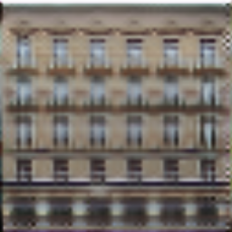
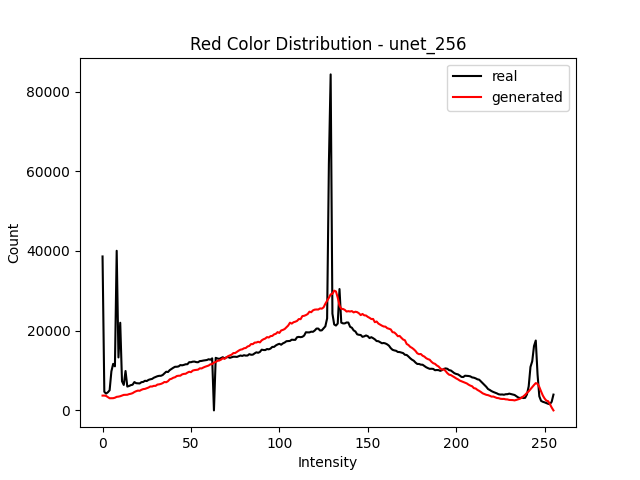
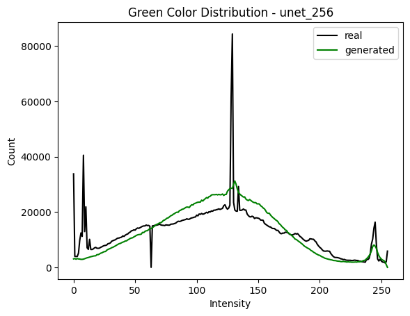
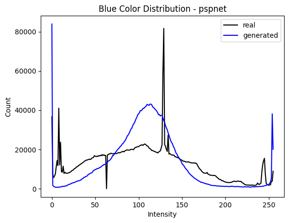

# Reproducibility Project Blog
## Group Members
- Nikolay Blagoev (4998901 - <N.Blagoev@student.tudelft.nl>)
- William Narchi  (5046122 - <w.narchi-1@student.tudelft.nl>)

## Original paper
Image-to-Image Translation with Conditional Adversarial Networks.<br>
[Phillip Isola](https://people.eecs.berkeley.edu/~isola), [Jun-Yan Zhu](https://www.cs.cmu.edu/~junyanz/), [Tinghui Zhou](https://people.eecs.berkeley.edu/~tinghuiz), [Alexei A. Efros](https://people.eecs.berkeley.edu/~efros). In CVPR 2017. [[Bibtex]](https://www.cs.cmu.edu/~junyanz/projects/pix2pix/pix2pix.bib)

## Introduction
Conditional adversarial networks are a popular architecture choice for generative models. The Pix2Pix paper examined by this reproducibility project presents a general **CGAN (Conditional General Adversarial Network)** that can be adapted for *any* image-to-image translation task. Put simply, given labelled samples in two related domains $A$ and $B$, a mapping from $A$ to $B$ (or vice versa) can be learned by the network [1].

The architecture of the network consists of a generator network and a discriminator network working against each other [1]. The generator learns to generate plausible fake images in the target range that correspond to the source domain and the discriminator learns to differentiate real and fake (generator-created) images.

The Pix2Pix paper utilises a modified variant of the [UNet](https://arxiv.org/abs/1505.04597) architecture as the generator [1], [2]. However, in principle, any network that performs [semantic segmentation](https://www.cs.toronto.edu/~tingwuwang/semantic_segmentation.pdf) can be used as the generator in the CGAN architecture. This project aims to compare the viability of popular semantic segmentation networks as replacements for the stock UNet presented in the original paper.

## Generator Networks Tested
- UNet [Architecture and implementation specified in Pix2Pix paper and stock codebase]
- ResNet w/ 9 blocks [[Paper](https://arxiv.org/abs/1512.03385)] [Implementation in stock codebase]
- UNet++ [[Paper](https://arxiv.org/pdf/1807.10165.pdf)] [SMP]
- DeepLabV3+ [[Paper](https://arxiv.org/abs/1802.02611)] [SMP]
- PSPNet [[Paper](https://arxiv.org/abs/1612.01105)] [SMP]
- HRNet [[Paper](https://arxiv.org/abs/1908.07919)] [[Implementation](https://github.com/HRNet/HRNet-Semantic-Segmentation)]
- LinkNet [[Paper](https://arxiv.org/abs/1707.03718)] [SMP]

For each we model, we adapted its structure to follow the generator structure described in the Pix2Pix paper (convolution → batch normalisation → ReLu) [1]. For most models, the [SMP API](https://github.com/qubvel/segmentation_models.pytorch) implementation was utilised.

## Experimental setup
Due to time limitations we tested only on the [`facades`](https://cmp.felk.cvut.cz/~tylecr1/facade/) dataset [3].

A generator network was trained with each decoder for 200 epochs. The final results were then evaluated qualitatively (visual appearance) and quantitatively (via the FID score and a comparison of the loss scores). We chose the measures from [4](https://arxiv.org/abs/1802.03446) based on how useful they were for our purposes. 

## Mode collapse
Following the architecture described in the paper (convolution → batch normalisation → ReLu), we encountered mode collapse (the generator found a single image which would consistently trick the discriminator):

<br>

<br>

This happened regardless of the exact model used as the generator. If the last ReLU activation layer was removed, patchy artifacts were produced (even at 200 epochs):

<br>

<br>

The original implementation adds a Tanh activation function at the outermost upscaling layer:
```python
if outermost:
    upconv = nn.ConvTranspose2d(inner_nc * 2, outer_nc,
                                kernel_size=4, stride=2,
                                padding=1)
    down  = [downconv]
    up    = [uprelu, upconv, nn.Tanh()]
    model = down + [submodule] + up

```
Thus, we followed the same structure. All layers apart from the last one have a ReLU activation while the outtermost one has a Tanh.


## Qualitative Evaluation
| Real                                     | UNet                                          | ResNet (9 blocks)                               | UNet++                                          | DeepLabV3+                                       | PSPNet                                       | LinkNet                                          | HRNet                                          |
|------------------------------------------|-----------------------------------------------|-------------------------------------------------|-------------------------------------------------|--------------------------------------------------|----------------------------------------------|--------------------------------------------------|------------------------------------------------|
|  |  |  |  |  |  |  |  |
|   |   |   |   |   |   |   |   |

All generators were able to recreate some semblance of structure in the fake (or generated) image. Some notion of windows and a facade exist in all of them.

Visually, PSPNet gave the worst results; the final result is blurry and black patches can be seen in the same spot on all images. The second worst was DeepLabV3+; a more clear structure can be seen in it, however some artifacts exist (bottom row is best seen) and the images are quite blurry. HRNet gave decent results, however they still look quite blurry. Surprisingly, the LinkNet produced a very clear and coherent image for the first input. The best performing were the two UNets, followed closely by LinkNet and the 9-block ResNet, though for the second row some artifacts can be seen (quite noticeable with UNet++ and 9-block Resnet, in addition to some with UNet at the bottom part of the building).

## Quantitative Evaluation
### FID Scores
The **Frechet Inception Distance (FID)** is used to evaluate the quality of generated images. It compares the excitation of a feature extractor of the ground truth and generated images to produce a single scalar score, where lower means better. [5] Since the release of the paper in 2017, it has become a de facto standard for evaluating the performance of generative networks [4]. 

For the feature extractor, we chose the InceptionV3 model [6]. A batch of 40 previously unseen images were fed to the generator. The new 'fake' images were then compared with the ground truth and the FID scores for each generator (evaluated after 200 epochs) are given below:

| Generator         | FID     |
|-------------------|---------|
| UNet (default)    | 218.483 |
| ResNet (9 blocks) | 226.530 |
| UNet++            | 244.796 |
| DeepLabV3+        | 318.598 |
| PSPNet            | 416.964 |
| LinkNet           | 232.488 |
| HRNet             | 297.469 |

PSPNet performed the worst (as evident by the results). Surprisingly, LinkNet presented a better result than UNet++. The stock UNet variant used in the original paper performed the best, but we attribute this to hyperparameter tuning, which we were not able to perform due to limited training time.

### Performance Over Epochs
#### FID Scores
In order to better understand how the generators' performance evolves over time, we provide graphs of FID scores plotted against training epochs for all tested generators.

All tested generators exhibit a general performance improvement as the number of training epochs increases. The most performant ones have an almost monotonically decreasing trend, while the least performant have several erratic spikes. This might be indicative of poor hyperparameter tuning or the generator's inability to adequately generalise over the course of training.

##### UNet


##### ResNet


##### UNet++


##### DeepLabV3+


##### PSPNet


##### LinkNet


##### HRNet


#### Colour Distributions
<!-- TODO: Compare with K-S test -->
A metric of interest is the colour distribution of the outputs of each generator. Our hypothesis is that generators which give the best results also approximate well the colour distributions of the original images. Also, it is interesting to investigate whether some generators demonstrate a preference for certain colour extremes (darker images, more blue, etc).

We chose to conduct this investigation with the stock UNet, UNet++, LinkNet, and PSPNet only as these provide a good overview of different performance levels and as analysis of the results from other tested networks would yield very similar conclusions. The stock UNet represents the baseline (and best performance) to compare to. UNet++ is intended to be an improvement to UNet and so it is of interest to analyse due to its close relation with the paper's stock CGAN architecture. LinkNet provided the best results of the non-stock generators that were examined and so further analysis of it in order to visualise why it performs so well would be of interest. Lastly, PSPNet provided the worst results of the tested networks and would be similarly interesting to analyse in order to gauge its ill-fitedness for the task.

First we investigate the results of the stock UNet generator.
<br>



<br>
As can be seen - for all channels - the distributions of the real and fake images have a similar mean and a bump can be seen at the highest values (above 240). The spikes in the real distribution for values lower than 20 are because many of the source images include black frames blocking parts of the image. The UNet generator estimates the true colour distribution well.

Next, we investigate the results of the UNet++ decoder.
<br>


<br>
The UNet++ decoder estimates even better the true distribution with a much more noticeable spike at the mean value.

Next is LinkNet.
<br>


<br>
LinkNet exhibits performance somewhere between UNet++ and UNet, with a much lower spike in the mean values than UNet++.

Lastly is PSPNet
<br>



<br>
PSPNet seems to have been influenced a lot more by the dark patches, generating many more more black pixels compared to the other generators. It also has a slightly off mean value for the blue pixel intensity distribution.

## Discussion

The original paper used a UNet-based autoencoder with 6 downsampling (and corresponding upsampling layers) for their generator [1]. UNet was originally developed for biomedical image segmentation and was shown to outperform most other networks in most tasks where data is sparse [2]. The `facades` dataset consists of about 500 images, which could be one of the resons why it is able to produce better results than other decoders [3].  

The UNet++ was designed as an improvement to the original UNet network. It made use of improved skip connections and deep suppervision, the latter allowing for more stable results and faster convergeance [7]. In [[7](https://arxiv.org/pdf/1807.10165.pdf)] they demonstrated a minor improvement of the UNet++ autoencoder over its predecessor. Thus we expected the UNet++ to perform as well, if not better than the stock network. Throughout our tests we saw it perform close to the UNet autoencoder. As mentioned in the limitations section, we believe that with some hyper parameter tuning, UNet++ and LinkNet would have seen a decent improvement in performance.

Unlike the previous two, LinkNet was not designed for the biomedical domain, but was instead intended for real-time visual semantic segmentation [8]. It has an architecture similar to UNet, consisting of a downsampling part (convolution with ReLu and spatial maxpooling, as well as skip connections to the corresponding upsampling block) [8]. In our experiments it gave one of the sharpest (i.e. not blurry) and most structured outputs. 

### Similar findings
Of interest are two works [[9]](https://arxiv.org/pdf/2009.06412.pdf) and [[10]](https://ieeexplore.ieee.org/document/9213817), which both compared the performance of different autoencoder architectures on the same task. The former found that UNet and Linknet gave similar results, while both outperformed quite significantly PSPNet. The latter found a noticeable improvement of LinkNet above UNet. Our own findings mirrored those of the two papers, with the two UNet networks performing similar to LinkNet, and PSPNet giving a decently worse performance.

## Limitations and Future Work
Due to time restrictions, the generators were trained only on the `facade` dataset. It would be interesting to see if the results also hold for other labeled datasets on which Pix2Pix was evaluated.

Also, as mentioned before, we were not able to perform hyperparameter tuning, which we recognise as a potential reason why all architectures proposed by us performed worse than the defaul UNet (the one used in the original paper). However, as seen, LinkNet and UNet++ both came close in performance without any additional optimisation.

## Work Distribution
- Nikolay Blagoev
  - Added UNet++, LinkNet, and PSPNet
  - Performed FID evaluation and colour distribution comparison
  - Wrote qualitative evaluation and discussion
- William Narchi
  - Added HRNet and DeeplabV3+
  - Tested each generator's performance over epochs
  - Trained the models
  - Wrote introduction

## Bibliography
[1] P. Isola, J.-Y. Zhu, T. Zhou, and A. A. Efros, “Image-to-image translation with conditional adversarial networks,” 2017 IEEE Conference on Computer Vision and Pattern Recognition (CVPR), 2017.  

[2] Ronneberger, O., Fischer, P., & Brox, T. (2015). U-net: Convolutional networks for biomedical image segmentation. In Medical Image Computing and Computer-Assisted Intervention–MICCAI 2015: 18th International Conference, Munich, Germany, October 5-9, 2015, Proceedings, Part III 18 (pp. 234-241). Springer International Publishing.

[3] R. Tyleček and R. Šára, “Spatial pattern templates for recognition of objects with regular structure,” Lecture Notes in Computer Science, pp. 364–374, 2013. 

[4] A. Borji, “Pros and cons of gan evaluation measures,” Computer Vision and Image Understanding, vol. 179, pp. 41–65, 2019. 

[5] M. Heusel, H. Ramsauer, T. Unterthiner, B. Nessler, and S. Hochreiter, ‘GANs Trained by a Two Time-Scale Update Rule Converge to a Local Nash Equilibrium’, in Advances in Neural Information Processing Systems, 2017, vol. 30.

[6] C. Szegedy et al., ‘Going Deeper with Convolutions’, CoRR, vol. abs/1409.4842, 2014.

[7] Z. Zhou, M. M. R. Siddiquee, N. Tajbakhsh, and J. Liang, ‘UNet++: A Nested U-Net Architecture for Medical Image Segmentation’, CoRR, vol. abs/1807.10165, 2018.

[8] A. Chaurasia and E. Culurciello, ‘LinkNet: Exploiting Encoder Representations for Efficient Semantic Segmentation’, CoRR, vol. abs/1707.03718, 2017.

[9] P. Bizopoulos, N. Vretos, and P. Daras, ‘Comprehensive Comparison of Deep Learning Models for Lung and COVID-19 Lesion Segmentation in CT scans’, arXiv [eess.IV]. 2022.

[10] V. A. Natarajan, M. Sunil Kumar, R. Patan, S. Kallam, and M. Y. Noor Mohamed, ‘Segmentation of Nuclei in Histopathology images using Fully Convolutional Deep Neural Architecture’, in 2020 International Conference on Computing and Information Technology (ICCIT-1441), 2020, pp. 1–7.

<!------------------------------------------------------------------>
# Original Repository README
## Getting Started
### Installation
- Clone this repo:
```bash
git clone https://github.com/junyanz/pytorch-CycleGAN-and-pix2pix
cd pytorch-CycleGAN-and-pix2pix
```

- Install [PyTorch](http://pytorch.org) and 0.4+ and other dependencies (e.g., torchvision, [visdom](https://github.com/facebookresearch/visdom) and [dominate](https://github.com/Knio/dominate)).
  - For pip users, please type the command `pip install -r requirements.txt`.
  - For Conda users, you can create a new Conda environment using `conda env create -f environment.yml`.
  - For Docker users, we provide the pre-built Docker image and Dockerfile. Please refer to our [Docker](docs/docker.md) page.
  - For Repl users, please click [](https://repl.it/github/junyanz/pytorch-CycleGAN-and-pix2pix).


### pix2pix train/test
- Download a pix2pix dataset (e.g.[facades](http://cmp.felk.cvut.cz/~tylecr1/facade/)):
```bash
bash ./datasets/download_pix2pix_dataset.sh facades
```
- To view training results and loss plots, run `python -m visdom.server` and click the URL http://localhost:8097.
- To log training progress and test images to W&B dashboard, set the `--use_wandb` flag with train and test script
- Train a model:
```bash
#!./scripts/train_pix2pix.sh
python train.py --dataroot ./datasets/facades --name facades_pix2pix --model pix2pix --direction BtoA
```
To see more intermediate results, check out  `./checkpoints/facades_pix2pix/web/index.html`.

- Test the model (`bash ./scripts/test_pix2pix.sh`):
```bash
#!./scripts/test_pix2pix.sh
python test.py --dataroot ./datasets/facades --name facades_pix2pix --model pix2pix --direction BtoA
```
- The test results will be saved to a html file here: `./results/facades_pix2pix/test_latest/index.html`. You can find more scripts at `scripts` directory.
- To train and test pix2pix-based colorization models, please add `--model colorization` and `--dataset_mode colorization`. See our training [tips](https://github.com/junyanz/pytorch-CycleGAN-and-pix2pix/blob/master/docs/tips.md#notes-on-colorization) for more details.


### Apply a pre-trained model (pix2pix)
Download a pre-trained model with `./scripts/download_pix2pix_model.sh`.

- Check [here](https://github.com/junyanz/pytorch-CycleGAN-and-pix2pix/blob/master/scripts/download_pix2pix_model.sh#L3) for all the available pix2pix models. For example, if you would like to download label2photo model on the Facades dataset,
```bash
bash ./scripts/download_pix2pix_model.sh facades_label2photo
```
- Download the pix2pix facades datasets:
```bash
bash ./datasets/download_pix2pix_dataset.sh facades
```
- Then generate the results using
```bash
python test.py --dataroot ./datasets/facades/ --direction BtoA --model pix2pix --name facades_label2photo_pretrained
```
- Note that we specified `--direction BtoA` as Facades dataset's A to B direction is photos to labels.

- If you would like to apply a pre-trained model to a collection of input images (rather than image pairs), please use `--model test` option. See `./scripts/test_single.sh` for how to apply a model to Facade label maps (stored in the directory `facades/testB`).

- See a list of currently available models at `./scripts/download_pix2pix_model.sh`

## [Docker](docs/docker.md)
We provide the pre-built Docker image and Dockerfile that can run this code repo. See [docker](docs/docker.md).

## [Datasets](docs/datasets.md)
Download pix2pix/CycleGAN datasets and create your own datasets.

## [Training/Test Tips](docs/tips.md)
Best practice for training and testing your models.

## [Frequently Asked Questions](docs/qa.md)
Before you post a new question, please first look at the above Q & A and existing GitHub issues.

## Custom Model and Dataset
If you plan to implement custom models and dataset for your new applications, we provide a dataset [template](data/template_dataset.py) and a model [template](models/template_model.py) as a starting point.

## [Code structure](docs/overview.md)
To help users better understand and use our code, we briefly overview the functionality and implementation of each package and each module.

## Pull Request
You are always welcome to contribute to this repository by sending a [pull request](https://help.github.com/articles/about-pull-requests/).
Please run `flake8 --ignore E501 .` and `python ./scripts/test_before_push.py` before you commit the code. Please also update the code structure [overview](docs/overview.md) accordingly if you add or remove files.

## Citation
If you use this code for your research, please cite our papers.
```
@inproceedings{CycleGAN2017,
  title={Unpaired Image-to-Image Translation using Cycle-Consistent Adversarial Networks},
  author={Zhu, Jun-Yan and Park, Taesung and Isola, Phillip and Efros, Alexei A},
  booktitle={Computer Vision (ICCV), 2017 IEEE International Conference on},
  year={2017}
}


@inproceedings{isola2017image,
  title={Image-to-Image Translation with Conditional Adversarial Networks},
  author={Isola, Phillip and Zhu, Jun-Yan and Zhou, Tinghui and Efros, Alexei A},
  booktitle={Computer Vision and Pattern Recognition (CVPR), 2017 IEEE Conference on},
  year={2017}
}
```

## Other Languages
[Spanish](docs/README_es.md)

## Related Projects
**[contrastive-unpaired-translation](https://github.com/taesungp/contrastive-unpaired-translation) (CUT)**<br>
**[CycleGAN-Torch](https://github.com/junyanz/CycleGAN) |
[pix2pix-Torch](https://github.com/phillipi/pix2pix) | [pix2pixHD](https://github.com/NVIDIA/pix2pixHD)|
[BicycleGAN](https://github.com/junyanz/BicycleGAN) | [vid2vid](https://tcwang0509.github.io/vid2vid/) | [SPADE/GauGAN](https://github.com/NVlabs/SPADE)**<br>
**[iGAN](https://github.com/junyanz/iGAN) | [GAN Dissection](https://github.com/CSAILVision/GANDissect) | [GAN Paint](http://ganpaint.io/)**

## Cat Paper Collection
If you love cats, and love reading cool graphics, vision, and learning papers, please check out the Cat Paper [Collection](https://github.com/junyanz/CatPapers).

## Acknowledgments
Our code is inspired by [pytorch-DCGAN](https://github.com/pytorch/examples/tree/master/dcgan).
