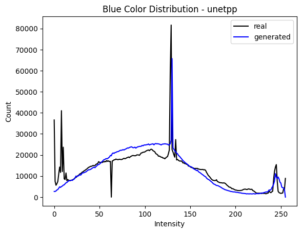
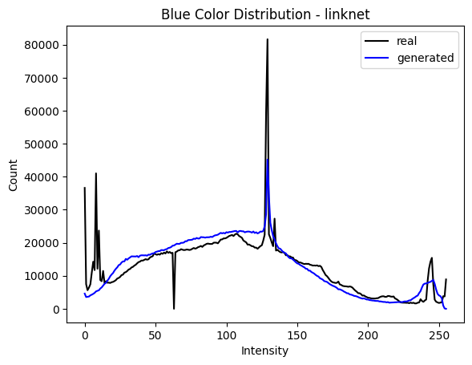
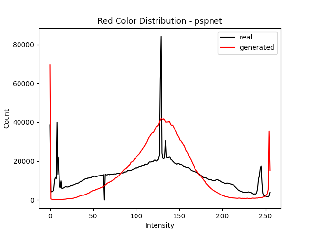

# CycleGAN and pix2pix in PyTorch - FORK
## Nikolay Blagoev and William Narchi
<br>

## The aim of this project is to evaluate pix2pix with different generators
<br>

## Original paper

Image-to-Image Translation with Conditional Adversarial Networks.<br>
[Phillip Isola](https://people.eecs.berkeley.edu/~isola), [Jun-Yan Zhu](https://www.cs.cmu.edu/~junyanz/), [Tinghui Zhou](https://people.eecs.berkeley.edu/~tinghuiz), [Alexei A. Efros](https://people.eecs.berkeley.edu/~efros). In CVPR 2017. [[Bibtex]](https://www.cs.cmu.edu/~junyanz/projects/pix2pix/pix2pix.bib)

## Introduction
TODO : ADD

## Decoder Networks Tested
- Unet (default for pix2pix)
- Unet++ [paper](https://arxiv.org/pdf/1807.10165.pdf)
- DeepLabV3+ [paper](https://arxiv.org/abs/1802.02611)
- PSPNet [paper](https://arxiv.org/abs/1612.01105)
- HRNet [paper](TODO : ADD)
- LinkNet [paper](https://arxiv.org/abs/1707.03718)
TODO - ADD LINKS TO IMPLEMENTATIONS

For each we followed the generator struture described in the paper (Convolution, Batch Normalisation, Relu).

## Experimental setup
Due to time limitations we tested only on the [facades](https://cmp.felk.cvut.cz/~tylecr1/facade/) dataset.

A generator network was trained with each decoder for 200 epochs. The final results were then evaluated qualitatively (visual appearance) and quantitatively (via the FID score and a comparison of the loss scores). We chose the measures from this [paper](https://arxiv.org/abs/1802.03446) based on how useful they were for our purposes. 

## Mode collapse
Following the architecture described in the paper (Convolution, Batch Normalisation, Relu), we encountered mode collapse (the GAN found a single image which would trick the discriminator):


<br>

This happened regardless of the decoder used in the generator. If the last ReLU activation layer was removed, patchy artificats were produced (even at 200 epochs):


<br>

The original implementation adds a TanH activation function at the outter most upscaling layer:

```python
if outermost:
    upconv = nn.ConvTranspose2d(inner_nc * 2, outer_nc,
                                  kernel_size=4, stride=2,
                                  padding=1)
    down = [downconv]
    up = [uprelu, upconv, nn.Tanh()]
    model = down + [submodule] + up

```

Thus we followed the same structure. All layers apart from the last one had a ReLU activation, while the outtermost one - a Tanh.


## Qualitative Evaluation
| Real   |      Unet   |    Unet++    |    DeeplabV3+    |   PSPNet    |   LinkNet    | HRNET    |
|----------|:---------:|:---------:|:---------:|:---------:|:---------:|----------:|
|  |   |  | |  |  |  |
|  |   |  | |  |  |  |


<br>


All generators were able to recreate some semblance of structure in the fake (or generated) image. Some notion of windows and a facade exist in all of them.

Visually, PSPNet decoder gave the worst results. The final result is blurry and black patches can be seen in the same spot on all images. Second worst was the DeepLabV3+. A more clear structure can be seen in it, however some artifacts exist (bottom row is best seen) and the images are quite blurry. HRNet gave decent results, however they still look quite blurry. Surprisingly, the LinkNet produced a very clear and coherent image for the first input. The best performing were the two UNets (and close the LinkNet), though for the second row some artifacts can be seen (quite noticeable in the UNet++ and some in the UNet at the bottom part of the building).
<br>

## Quantitative Evaluation
### FID scores

The Frechet Inception Distance is used to evaluate the quality of generated images. It compares the excitation of a feature extractor of the ground truth and generated images to produce a single scalar score, where lower means better. Since the release of the paper in 2017, it has become a de facto standard for evaluating the performance of generative networks. 

For the feature extractor we chose the InceptionV3. A batch of 40 previously unseen images were fed to the generator. The new "fake" images were then compared with the ground truth and the fid scores for each decoder are given below:

|   |     FID    | 
|----------|------:|
| UNet (default) | 218.483 |
| UNet++ |   244.796 |
| DeepLabV3+ |    318.598 |
| PSPNet |    416.964 |
| LinkNet |    232.488 |
| HRNet |    297.469 |

PSPNet performed the worst (as evident by the results). Surprisingly, the LinkNet gave a lower result than the UNet++. Their stock UNet performed the best, but we attribute this to hyperparameter tuning, which we were not able to do, due to limited training time.


### Performance Over Epochs

### Colour distributions

TODO: compare with K-S test

Of interest could also be the colour disributions of each decoder. Our hypothesis is that decoders who give the best results also approximate well the colour distributions of the original images. Also it could be interesting to investigate whether some decoders generate a preference for certain colour extremes (darker images, more blue, etc).

First we investigate the results of the stock unet decoder.


<br>

<br>

<br>

As seen, for all channels, the distribution of the real and fake images has a similar mean and a bump can be seen at the highest values (above 240). The spikes in the real distribution for values lower than 20 are because many of the source images includded black frames blocking part of the image. The unet generator estimates the true colour distribution well.


First we investigate the results of the UNet++ decoder.


<br>

<br>

<br>

The UNet++ decoder estimates even better the true distribution with a much more noticeable spike at the mean value.

Next is linknet.


<br>

<br>

<br>

Linknet has a performance somewhere between the UNet++ and the Unet, with a much more lower spike in the mean values than UNet++.

Lastly is PSPNet


<br>

<br>

<br>
<br>

PSP net seems to have been influenced a lot more by the dark patches, generating a lot more black pixels compared to the other decoders. It also has a slightly off mean value for the blue pixel intensity distribution.

## Discussion

TODO: WHY ARE THE GOOD ONES GOOD AND THE BAD ONES BAD

The original paper used a UNet-based autoencoder with 6 downsampling (and corresponding upsampling layers) for their generator. The UNet was originally developed for biomedical image segmentation and was shown to outperform most other networks in most tasks where data is sparse. The facades dataset consists of about 500 images, which could be one of the resons why it is able to produce better results than other decoders.  

The UNet++ was designed as an improvement to the original UNet network. It made use of improved skip connections and deep suppervision, the latter allowing for more stable results and faster convergeance. In [link] they demonstrated a minor improvement of the UNet++ autoencoder over its predecessor. Thus we expected the UNet++ to perform as well, if not better than the stock network. Throughout our tests we saw it perform close to the UNet autoencoder. As mentioned in the limitations section, we believe that with some hyper parameter tuning, UNet++ and LinkNet would have seen a decent improvement in performance.

Unlike the previous two, LinkNet was not designed for the biomedical domain, but was instead intended for real-time visual semantic segmentation. It has an architecture similar to UNet, consisting of a downsampling part (convolution with relu and spatial maxpooling, as well as skip connections to the corresponding upsampling block). In our experiments it gave one of the sharpest (i.e. not blurry) and most structured outputs. 

### Similar findings

Of interest are two works [https://arxiv.org/pdf/2009.06412.pdf] and [https://ieeexplore.ieee.org/document/9213817], which both compared the performance of different autoencoder architectures on the same task. The former found that UNet and Linknet gave similar results, while both outperformed quite significantly PSPNet. The latter found a noticeable improvement of LinkNet above UNet. Our own findings mirrored those of the two papers, with the two UNet networks performing similar to LinkNet, and PSPNet giving a decently worse performance.


## Limitation and future work

Due to time restrictions, the generators were trained only on the facade dataset. It would be interesting to see if the results also hold for other labeled datasets, on which pix2pix was evaluated.

## Getting Started
### Installation

- Clone this repo:
```bash
git clone https://github.com/junyanz/pytorch-CycleGAN-and-pix2pix
cd pytorch-CycleGAN-and-pix2pix
```

- Install [PyTorch](http://pytorch.org) and 0.4+ and other dependencies (e.g., torchvision, [visdom](https://github.com/facebookresearch/visdom) and [dominate](https://github.com/Knio/dominate)).
  - For pip users, please type the command `pip install -r requirements.txt`.
  - For Conda users, you can create a new Conda environment using `conda env create -f environment.yml`.
  - For Docker users, we provide the pre-built Docker image and Dockerfile. Please refer to our [Docker](docs/docker.md) page.
  - For Repl users, please click [](https://repl.it/github/junyanz/pytorch-CycleGAN-and-pix2pix).


### pix2pix train/test
- Download a pix2pix dataset (e.g.[facades](http://cmp.felk.cvut.cz/~tylecr1/facade/)):
```bash
bash ./datasets/download_pix2pix_dataset.sh facades
```
- To view training results and loss plots, run `python -m visdom.server` and click the URL http://localhost:8097.
- To log training progress and test images to W&B dashboard, set the `--use_wandb` flag with train and test script
- Train a model:
```bash
#!./scripts/train_pix2pix.sh
python train.py --dataroot ./datasets/facades --name facades_pix2pix --model pix2pix --direction BtoA
```
To see more intermediate results, check out  `./checkpoints/facades_pix2pix/web/index.html`.

- Test the model (`bash ./scripts/test_pix2pix.sh`):
```bash
#!./scripts/test_pix2pix.sh
python test.py --dataroot ./datasets/facades --name facades_pix2pix --model pix2pix --direction BtoA
```
- The test results will be saved to a html file here: `./results/facades_pix2pix/test_latest/index.html`. You can find more scripts at `scripts` directory.
- To train and test pix2pix-based colorization models, please add `--model colorization` and `--dataset_mode colorization`. See our training [tips](https://github.com/junyanz/pytorch-CycleGAN-and-pix2pix/blob/master/docs/tips.md#notes-on-colorization) for more details.


### Apply a pre-trained model (pix2pix)
Download a pre-trained model with `./scripts/download_pix2pix_model.sh`.

- Check [here](https://github.com/junyanz/pytorch-CycleGAN-and-pix2pix/blob/master/scripts/download_pix2pix_model.sh#L3) for all the available pix2pix models. For example, if you would like to download label2photo model on the Facades dataset,
```bash
bash ./scripts/download_pix2pix_model.sh facades_label2photo
```
- Download the pix2pix facades datasets:
```bash
bash ./datasets/download_pix2pix_dataset.sh facades
```
- Then generate the results using
```bash
python test.py --dataroot ./datasets/facades/ --direction BtoA --model pix2pix --name facades_label2photo_pretrained
```
- Note that we specified `--direction BtoA` as Facades dataset's A to B direction is photos to labels.

- If you would like to apply a pre-trained model to a collection of input images (rather than image pairs), please use `--model test` option. See `./scripts/test_single.sh` for how to apply a model to Facade label maps (stored in the directory `facades/testB`).

- See a list of currently available models at `./scripts/download_pix2pix_model.sh`

## [Docker](docs/docker.md)
We provide the pre-built Docker image and Dockerfile that can run this code repo. See [docker](docs/docker.md).

## [Datasets](docs/datasets.md)
Download pix2pix/CycleGAN datasets and create your own datasets.

## [Training/Test Tips](docs/tips.md)
Best practice for training and testing your models.

## [Frequently Asked Questions](docs/qa.md)
Before you post a new question, please first look at the above Q & A and existing GitHub issues.

## Custom Model and Dataset
If you plan to implement custom models and dataset for your new applications, we provide a dataset [template](data/template_dataset.py) and a model [template](models/template_model.py) as a starting point.

## [Code structure](docs/overview.md)
To help users better understand and use our code, we briefly overview the functionality and implementation of each package and each module.

## Pull Request
You are always welcome to contribute to this repository by sending a [pull request](https://help.github.com/articles/about-pull-requests/).
Please run `flake8 --ignore E501 .` and `python ./scripts/test_before_push.py` before you commit the code. Please also update the code structure [overview](docs/overview.md) accordingly if you add or remove files.

## Citation
If you use this code for your research, please cite our papers.
```
@inproceedings{CycleGAN2017,
  title={Unpaired Image-to-Image Translation using Cycle-Consistent Adversarial Networks},
  author={Zhu, Jun-Yan and Park, Taesung and Isola, Phillip and Efros, Alexei A},
  booktitle={Computer Vision (ICCV), 2017 IEEE International Conference on},
  year={2017}
}


@inproceedings{isola2017image,
  title={Image-to-Image Translation with Conditional Adversarial Networks},
  author={Isola, Phillip and Zhu, Jun-Yan and Zhou, Tinghui and Efros, Alexei A},
  booktitle={Computer Vision and Pattern Recognition (CVPR), 2017 IEEE Conference on},
  year={2017}
}
```

## Other Languages
[Spanish](docs/README_es.md)

## Related Projects
**[contrastive-unpaired-translation](https://github.com/taesungp/contrastive-unpaired-translation) (CUT)**<br>
**[CycleGAN-Torch](https://github.com/junyanz/CycleGAN) |
[pix2pix-Torch](https://github.com/phillipi/pix2pix) | [pix2pixHD](https://github.com/NVIDIA/pix2pixHD)|
[BicycleGAN](https://github.com/junyanz/BicycleGAN) | [vid2vid](https://tcwang0509.github.io/vid2vid/) | [SPADE/GauGAN](https://github.com/NVlabs/SPADE)**<br>
**[iGAN](https://github.com/junyanz/iGAN) | [GAN Dissection](https://github.com/CSAILVision/GANDissect) | [GAN Paint](http://ganpaint.io/)**

## Cat Paper Collection
If you love cats, and love reading cool graphics, vision, and learning papers, please check out the Cat Paper [Collection](https://github.com/junyanz/CatPapers).

## Acknowledgments
Our code is inspired by [pytorch-DCGAN](https://github.com/pytorch/examples/tree/master/dcgan).
